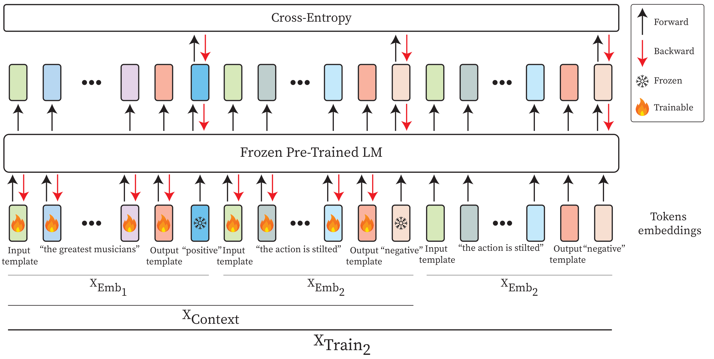

<div align="center">
  <h1>Context-aware Prompt Tuning: Advancing In-Context Learning with Adversarial Methods</h1>
</div>

<div align="center">
  <a href="https://tsachiblau.github.io/" target="_blank" class="link-no-underline">Tsachi Blau</a> | <a href="https://mkimhi.github.io/" target="_blank" class="link-no-underline">Moshe Kimhi</a> | <a href="https://belinkov.com/" target="_blank" class="link-no-underline">Yonatan Belinkov</a> | <a href="https://bron.cs.technion.ac.il/" target="_blank" class="link-no-underline">Alex M. Bronstein</a> | <a href="https://cris.bgu.ac.il/en/persons/chaim-baskin" target="_blank" class="link-no-underline">Chaim Baskin</a>
</div>

<div align="center">
Welcome to the official GitHub page for **Context-Aware Prompt Tuning (CPT)**. This repository provides an overview of CPT, our novel approach to advancing few-shot learning by combining In-Context Learning (ICL), Prompt Tuning (PT), and adversarial methods. Our technique optimizes context embeddings to improve accuracy and reduce overfitting in language models, particularly in challenging few-shot scenarios.
</div>

<div align="center", style="text-align: center;">

[](https://arxiv.org/abs/2410.17222)
[](https://colab.research.google.com/drive/1UhQDVhZ9bDlSk1551SuJV8tIUmlIayta?usp=sharing)
[](https://huggingface.co/docs/peft/main/en/package_reference/cpt)

</div>


---

## Abstract

Large Language Models (LLMs) can perform few-shot learning using either optimization-based approaches or In-Context Learning (ICL). Optimization-based methods often suffer from overfitting, as they require updating a large number of parameters with limited data. In contrast, ICL avoids overfitting but typically underperforms compared to optimization-based methods and is highly sensitive to the selection, order, and format of demonstration examples.

To overcome these challenges, we introduce Context-aware Prompt Tuning (CPT), a method inspired by ICL, Prompt Tuning (PT), and adversarial attacks. 
CPT builds on the ICL strategy of concatenating examples before the input, extending it by incorporating PT-like learning to refine the context embedding through iterative optimization, extracting deeper insights from the training examples. Our approach carefully modifies specific context tokens, considering the unique structure of the examples within the context.

In addition to updating the context with PT-like optimization, CPT draws inspiration from adversarial attacks, adjusting the input based on the labels present in the context while preserving the inherent value of the user-provided data. 
To ensure robustness and stability during optimization, we employ a projected gradient descent algorithm, constraining token embeddings to remain close to their original values and safeguarding the quality of the context.
Our method has demonstrated superior accuracy across multiple classification tasks using various LLM models, outperforming existing baselines and effectively addressing the overfitting challenge in few-shot learning.

---

## Motivation

In few-shot learning, optimization-based methods like fine-tuning and prompt tuning often overfit due to the limited training examples, resulting in poor generalization. Context-Aware Prompt Tuning (CPT) addresses this challenge by reducing overfitting while boosting performance.

<p align="center">
  
</p>
<p align="center">
  <em>Figure 1: Overfitting Comparison - CPT vs. Baselines</em>
</p>

---

## Comparison Between CPT and Other Methods

<p align="center">
  
</p>


In the context of few-shot learning, different methods employ tokens uniquely for input construction and optimization. In-Context Learning (ICL), Prompt Tuning (PT), and Instruction Prompt Tuning (IPT) serve as baseline approaches, each utilizing tokens differently.

This figure visually compares these methods by categorizing tokens based on their roles in the input prefix (blue background) and loss calculation (orange background). Tokens in the prefix are further divided into two groups: Learnable tokens (pink), which are updated during training, and Sample tokens (green), which remain fixed. The red line beneath tokens indicates those involved in loss calculation, while the green line beneath tokens signifies those updated during training. CPT introduces a novel approach by updating the Sample tokens during optimization, represented with dual-colored tokens to reflect their progression.

---

## Overview 

<p align="center">
  
</p>

This figure provides an overview of the training process for **Context-Aware Prompt Tuning (CPT)**. It highlights how tokens are structured and processed through the **frozen pre-trained language model (LM)**. Key components are outlined below:

1. **Input Construction**:
   - Tokens are divided into **input templates**, **output templates**, and **context tokens**.
   - Certain tokens are marked as **trainable** (indicated by fire icons), while others are **frozen** (indicated by snowflake icons). Trainable tokens, such as parts of the input and output templates, are updated during training, while frozen tokens remain unchanged.

2. **Forward and Backward Passes**:
   - **Forward Pass**: Black arrows show the flow of embeddings through the pre-trained model.
   - **Backward Pass**: Red arrows represent gradient updates applied only to the trainable tokens during optimization.

3. **Token Embeddings**:
   - Embeddings are split into trainable embeddings , context embeddings , and labeled training examples .
   - Trainable embeddings are optimized iteratively during training.

4. **Loss Calculation**:
   - The final loss is computed using **cross-entropy loss** on the labeled training examples (\(x_{Train}\)).

This process ensures efficient fine-tuning by optimizing specific tokens while keeping the majority of the pre-trained model frozen. This design balances adaptability and robustness, achieving strong performance in few-shot learning tasks.


---


## Key Contributions

- **Novel Few-Shot Learning Method**: We propose **Context-Aware Prompt Tuning (CPT)**, a novel few-shot method that combines the strengths of In-Context Learning (ICL), Prompt Tuning (PT), and adversarial methodologies. CPT carefully optimizes context tokens while accounting for their unique structure.

- **Innovative Loss Design**: Our method incorporates ground truth labels from the context into the loss term, optimizes the context with projected gradient descent (PGD), and employs a recency-bias-inspired loss weighting mechanism to enhance performance.

- **Introduction of Set Classification Task**: We introduce a new classification task, `Set Classification`, to evaluate our method’s effectiveness on tasks the model has not previously encountered, showcasing its robustness.

- **State-of-the-Art Results and Extensive Analysis**: CPT achieves state-of-the-art results across several classification datasets. We also provide extensive ablation studies, examining the impact of each design choice in our method.

These contributions demonstrate the versatility and effectiveness of CPT in addressing challenges in few-shot learning tasks.
We hope CPT proves valuable in your work, enabling efficient, accurate few-shot learning across language tasks.

---

## Citation

If you use CPT in your work, please cite our paper as follows:

```bibtex
@article{blau2024contextaware,
  title={Context-Aware Prompt Tuning: Advancing In-Context Learning with Adversarial Methods},
  author={Blau, Tsachi and Kimhi, Moshe and Belinkov, Yonatan and Bronstein, Alexander and Baskin, Chaim},
  journal={arXiv preprint arXiv:2410.17222},
  year={2024}
}
```
